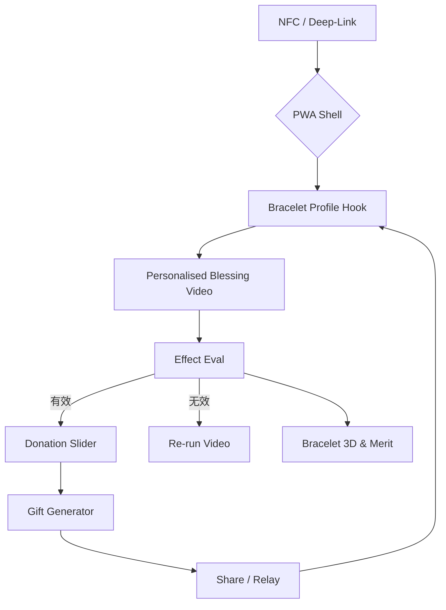

# Technical Architecture

## 1. Tech Stack
- **Frontend**: React 18  · Vite · TailwindCSS
- **Routing**: React-Router v6
- **PWA**: Workbox v6 (precache + runtime) · Web App Manifest
- **3D**: three.js + drei (GLB LOD)
- **State**: React-Query (async) + Zustand (UI)
- **Backend**: WordPress + Custom REST (`/bracelet-info`, `/relay`, `/donations`)
- **Payments**: Stripe (Intl) + WeChat JS-SDK (CN)
- **Analytics**: Umami self-hosted

## 2. Module Diagram

## 3. Data Flow
1. `chipId` → GET `/bracelet-info/v2/{id}` → user profile JSON
2. User actions → POST `/donations`, `/relay/join`, PATCH `/mood`
3. Service-Worker caches media; background-sync queues failed donations.

## 4. Performance Budget
| Category | Budget |
|----------|--------|
| LCP      | ≤1.8 s |
| JS/CSS   | ≤180 kB (gzip) |
| Video poster | ≤25 kB |
| 3D LOD0  | ≤150 kB |

## 5. Security & Privacy
- JWT stored in HttpOnly cookie; refresh 15 min.
- Rate-Limit 100 req / 5 min / IP.
- User can DELETE `/profile/{chipId}` to clear data.

## 6. CI / CD
- GitHub Actions → build & lighthouse-ci → Cloudflare Pages
- Budgets.json + failing build if over-size.

## 7. Future Scalability
- Move media to Cloudflare R2 + HLS edge caching.
- Supabase Channels for realtime relay map.

_Last update: 2024-07-09_ 